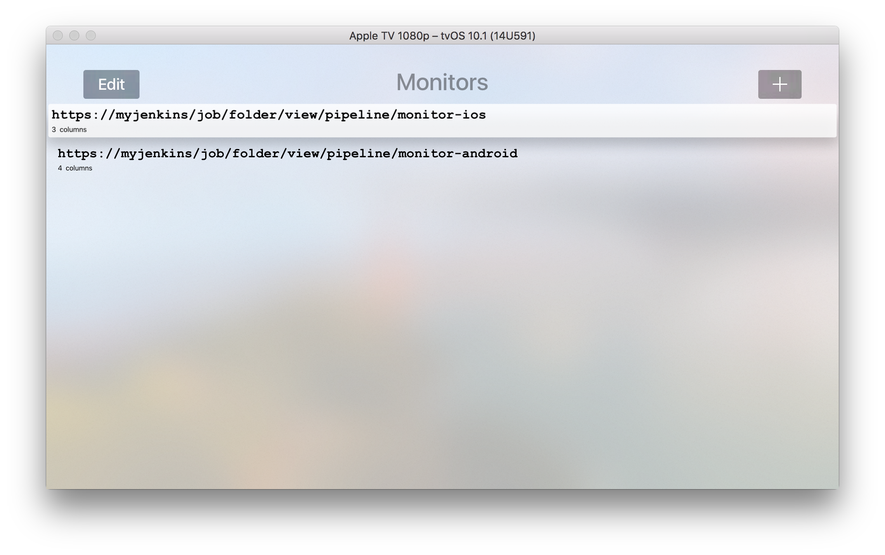
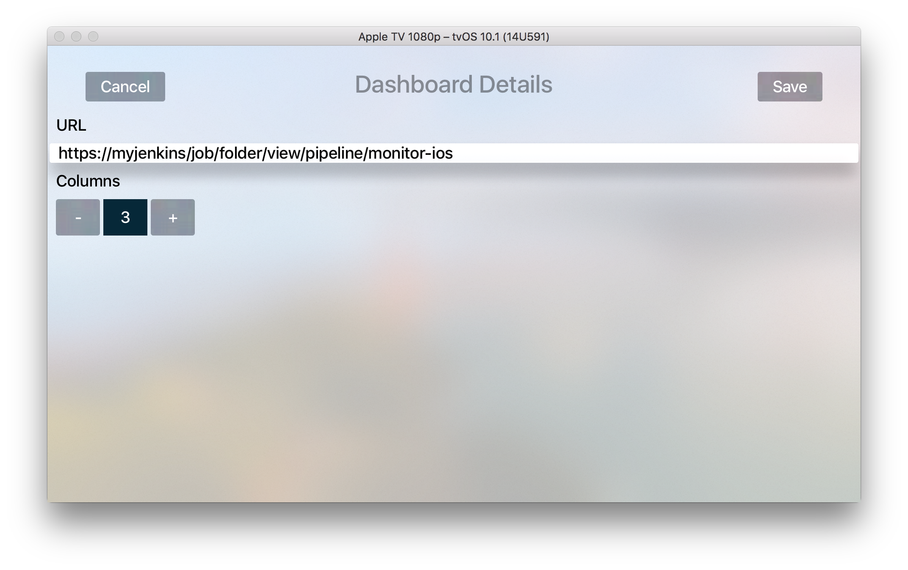
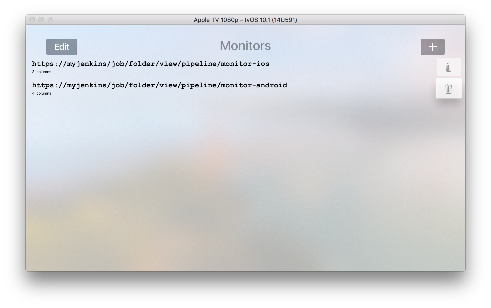
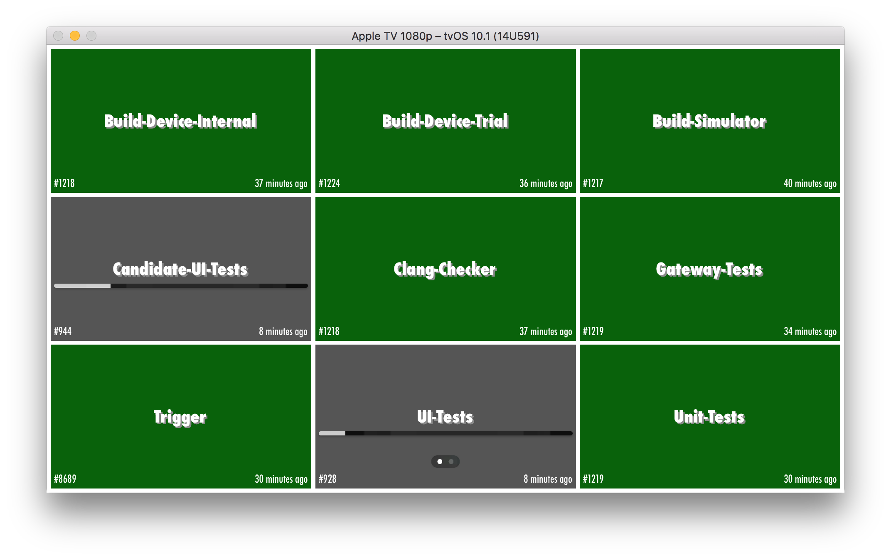
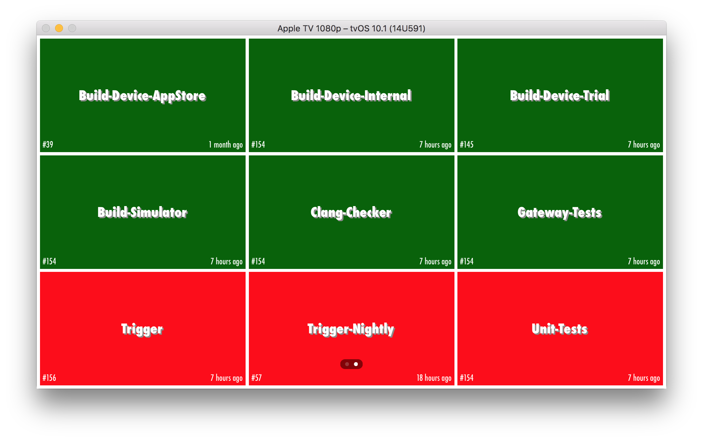

# Jenkins-Monitor-tvOS
Apple TV Monitor for Jenkins

First check if the [Build Monitor Plugin](https://wiki.jenkins-ci.org/display/JENKINS/Build+Monitor+Plugin) for Jenkins is installed and running.

If you don't have it yet, please install [Carthage](https://github.com/Carthage/Carthage). You can do it with homebrew:

```
brew update
brew install carthage
```

Then download this code, open its folder and build the dependencies:

```carthage update```

You should be able to execute the app now, open JenkinsMonitor.xcodeproj and run it.



Add some dashboards from your Jenkins, you must inform the full URL and choose the amount of columns.



If you don't use HTTPS on your Jenkins, I strongly recommend you start doing. If you can't control this policy and still want to monitor your jobs, [you may need to add exceptions to your plist file](https://forums.developer.apple.com/thread/6205). But remember that exchanging clear-text credentials may not be very wise (right, Blobb?).

If you want to delete some old dashboards, select Edit and then choose the rows you want to get rid of.



Press `Menu` anytime you want to see the Dashboards or return to Configuration screen. Jobs currently building will present a progress bar with estimated build time.



You can swipe left or right to see all dashboards, or press `Play/Pause` to allow Apple TV to alternate between all your dashboards automatically every 8 seconds per screen. In that case, pressing `Play/Pause` or swipe again will stop the automatic scroll.


